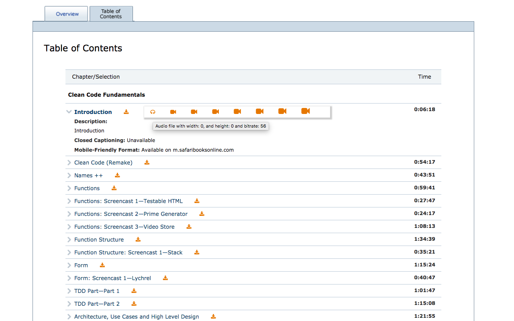
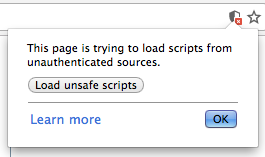

# Welcome to Safari (SBO) Chrome Video Extension

Where SBO refers to Safari Books Online (copyrights reserved)

## Features

This extension can be used for both new safari site and old site (techbus) to download the videos (but only if you have a registered account at Safari books online)

### The Old website (techbus)

The old website the one that have the domain name: `techbus.safaribooksonline.com`.

Once you have the extension installed, and you click on any video course, after a while (5 seconds) you will see a little red icon beside each video lesson allow you to download the video (see the picture).

### The new website
The new webiste that have the domain name: `www.safaribooksonline.com`

In case of the new website and after installing the extension and one you opened the video course main page that have the **Table of Contents** section, you first need to click on **load unsafe scripts**.

Then now you can enjoy the video downloads by clicking the little red icon beside each video lesson allow you to download the video (see the picture).

## Have issue?
Feel free to contact me via [opening an issue] (https://github.com/mhewedy/SBO-video-extension/issues/new), email or any mean if you need any help.
